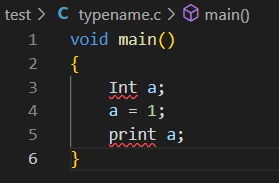

| 姓名   | 学号     | 班级       | 任务       | 权重   |
| ------ | -------- | ---------- | ---------- | ------ |
| Name   | No.      | Class      | Task       | Factor |
| 徐海东 | 31901028 | 计算机1901 | 编码、测试 | 1.0    |

1. 类型首字母要大写，不能小写

   修改Clex.fsl 中关键词信息

   

   

   如果小写：

   

2. 新增Float类型，但未完全实现。

   由于字符串转数字的parse函数只能返回单精度浮点数Single，因此实现Double可能更困难。

   

   

