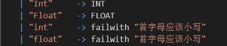
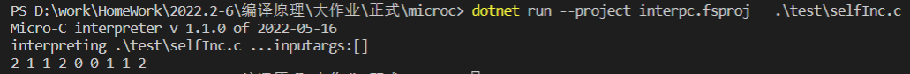

| 姓名   | 学号     | 班级       | 任务       | 权重   |
| ------ | -------- | ---------- | ---------- | ------ |
| Name   | No.      | Class      | Task       | Factor |
| 徐海东 | 31901028 | 计算机1901 | 编码、测试 | 1.0    |

## 解释器

### 类型检查：

#### 首字母要大写，不能小写；枚举完成；变量定义首字母小写

1. 步骤

   + 修改Clex.fsl 中关键词信息，正则表达式匹配首字母大写变量

   

2. 测试

```c
void main()
{
    // int a;
    Int A;
    // Int __;
    a = 1;
    print a;
}
```


如果类型小写、变量名以大写或__开头，则会报错提示：


### 未完全实现Float类型。

做的时候发现Store里面是存Int的，如果要增加float类型，难度有点大，因此就没有实现。**只做到**了能构造出AST这一部分。

同时字符串转数字的parse函数只能返回单精度浮点数Single，因此要去实现Double可能更困难。

1. 步骤

   1. 在Absyn.fs中增加Float类型，以及表达式

      

   2. 增加Clex.fsl 中关键词信息FLOAT、正则表达式提取浮点数

      

   3. 增加CPar.fsy中token的定义、FLOAT类型

   

   

2. 测试

   ```
   void main(){
       Float a ;
       a = 1.11111;
       print a;
   }
   ```

   

   

   

   可以看到，输出的并不是1，但是AST能构造出来。


### 新增自增自减运算符（i++,i--,--i,++i）

1. 步骤

   1. 在Absyn.fs中添加表达式

      

   2. 在CLex.fsl中添加 ++ 和 -- 的词法

      

   3. 在CPar.fsy中添加token：SELFPLUS、 SELFMINUS；运算优先级；非左值情况定义

      

   4. 在Interp.fs中加入新的eval

      ```
          | SelfOperation (msg,acc) ->
              match msg with   
              | "I++" -> 
                  let (loc, store1) = access acc locEnv gloEnv store
                  let pre = getSto store1 loc
                  let res = getSto store1 loc + 1
                  (pre, setSto store1 loc res)
              | "++I" -> 
                  let (loc, store1) = access acc locEnv gloEnv store
                  let res = getSto store1 loc + 1
                  (res, setSto store1 loc res)
              | "I--" ->
                  let (loc, store1) = access acc locEnv gloEnv store
                  let pre = getSto store1 loc
                  let res = getSto store1 loc - 1
                  (pre, setSto store1 loc res)
              | "--I" ->
                  let (loc, store1) = access acc locEnv gloEnv store
                  let res = getSto store1 loc - 1
                  (res, setSto store1 loc res)
              | _ -> failwith ("err for SelfOperation")
      ```

      

2. 测试

   ```
   void main()
   {
       // Int a;
       // Int b;
       // a = 1;
       // b = a++ * 3 * a;
       // print a;
       // print b;
       Int a;
       Int b;
       a = 1;
       b = a++;
       print a;
       print b;
       b = a--;
       print a;
       print b;
       b = --a;
       print a;
       print b;
       b = ++a;
       print a;   
       b = 2;
       print 2*b--; 
       b = 2;
       print --b;
   
   }
   ```




基本实现。

### 新增（+=，-=，*=，/= ）

1. 实现

   1. Clex.fsl中加入新规则

   2. CPar.fsy中定义token，增加非左值情况。

   

   3. Absyn.fs中加入新的expr 

      ```
      	ComplexOperation of string * access * expr
      ```

   4. Interp.c中加入新的eval

      ```
          | ComplexOperation(ope,acc,e) ->
              // x += 2
              let  (loc, store1) = access acc locEnv gloEnv store // 取x地址
              let  (i1)  = getSto store1 loc // 取x值
              let  (i2, store2) = eval e locEnv gloEnv store // 取2
              let  res =
                  match ope with
                  | "+="  -> i1 + i2
                  | "-="  -> i1 - i2
                  | "*="  -> i1 * i2
                  | "/="  -> i1 / i2
                  | "%="  -> i1 % i2
                  | _ -> failwith ("unknown primitive " + ope)
              (res, setSto store2 loc res)
      ```

      

2. 测试

   ```c
   void main()
   {
       Int x;
       x = 10;
       x += 2;
       print x; //12
       x -= 2;
       print x; //10
       x *= 2;
       print x; // 20
       x /= 2;
       print x; //10
       x %= 2; //0
       print x;   
   }
   ```


### 新增 for (i=0;i<5;i++)

1. 实现

   1. Clex.fsl中加入新规则   | "for"   -> FOR

   2. CPar.fsy中定义token(FOR) ; 增加StmtM。

      ```
        for (    i=0  ;    i<5  ;    i++   )   *
        FOR LPAR Expr SEMI Expr SEMI Expr RPAR StmtM { For($3,$5,$7,$9) }
      ```

   3. Absyn.fs中加入新的stmt 

      ```
      For of expr * expr * expr * stmt  
      ```

   4. Interp.c中加入新的exec

      ```
          | For (e1, e2, e3, body) ->
              let (v, store1) = eval e1 locEnv gloEnv store
              let rec loop store1 = 
                  let (v, store2) = eval e2 locEnv gloEnv store1
                  if v<>0 then
                      // 执行内部 语句
                      let store3 = exec body locEnv gloEnv store2
                      // i++
                      let (tmp, store4) = eval e3 locEnv gloEnv store3
                      loop store4
                  else store2
              loop store1
      ```

      

2. 测试

   ```c
   void main()
   {
       Int i;
       for ( i=0; i<5; i++) {
           print i;
       }
   }
   ```

   

### 新增 for i in range 3

1. 实现

   1. 在CLex.fsl中新增 | "in"    -> IN 、| "range"  -> RANGE

   2. 在CPar.fsy中新增token(IN RANGE); 增加StmtM

      ```
       | FOR Access IN RANGE LPAR Expr RPAR StmtM { ForRangeOne($2,$6,$8) }
      ```

   3. 在Absyn.fs中新增stmt 

      ```
      | ForRangeOne of access * expr * stmt
      ```

   4. 在Interp.c中加入新的exec

      ```
          | ForRangeOne (e1, e2, body) ->
              let (max,store) = eval e2 locEnv gloEnv store
              let (loc, store1) = access e1 locEnv gloEnv store
              // 赋初值
              let store2 = setSto store1 loc 0
              let rec loop store2 = 
                  let i = getSto store2 loc
                  if i<max then
                      let store3 = exec body locEnv gloEnv store2
                      let store4 = setSto store3 loc (i+1)
                      loop store4
                  else store2
              loop store2
      ```

2. 测试

   ```
   void main()
   {
       Int i;
       for i in range(3) {
           print i;
       }
   }
   ```

   

