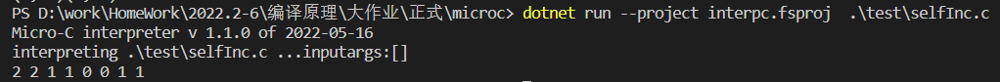

| 姓名   | 学号     | 班级       | 任务       | 权重   |
| ------ | -------- | ---------- | ---------- | ------ |
| Name   | No.      | Class      | Task       | Factor |
| 徐海东 | 31901028 | 计算机1901 | 编码、测试 | 1.0    |

## 解释器

### 类型检查：首字母要大写，不能小写

1. 步骤

   + 修改Clex.fsl 中关键词信息

   

2. 测试

如果小写：

### 未完全实现Float类型。

做的时候发现Store里面是存Int的，如果要增加float类型，难度有点大，因此就没有实现。**只做到**了能构造出AST这一部分。

同时字符串转数字的parse函数只能返回单精度浮点数Single，因此要去实现Double可能更困难。

1. 步骤

   1. 在Absyn.fs中增加Float类型，以及表达式

      

   2. 增加Clex.fsl 中关键词信息FLOAT、正则表达式提取浮点数

      

   3. 增加CPar.fsy中token的定义、FLOAT类型

   

   

2. 测试

   

   

   

   可以看到，输出的并不是1，但是AST能构造出来。

### 新增自增自减运算符（i++,i--,--i,++i）

1. 步骤

   1. 在Absyn.fs中添加表达式

      

   2. 在CLex.fsl中添加 ++ 和 -- 的词法

      

   3. 在CPar.fsy中添加token：SELFPLUS、 SELFMINUS；运算优先级；非左值情况定义

      

2. 测试

可以看到，基本的增加能实现，但是优先级还未实现。

