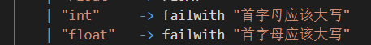
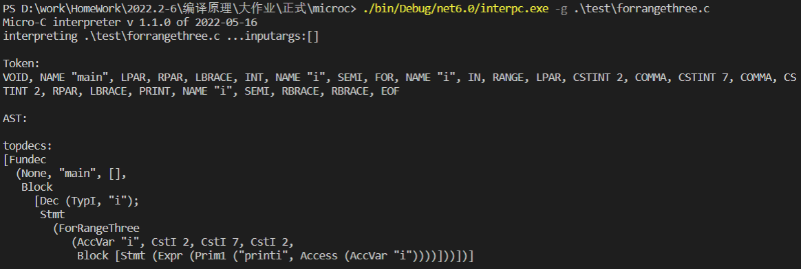

# 2020-2021学年第2学期

##  实 验 报 告


-   课程名称: <u>编程语言原理与编译</u>

-   实验项目: <u>期末大作业</u>

-   专业班级: <u>计算机1901</u>

-   学生学号: <u>31901028</u>

-   学生姓名: <u>徐海东</u>

-   实验指导教师:<u>郭鸣</u>

| 姓名   | 学号     | 班级       | 任务       | 权重   |
| ------ | -------- | ---------- | ---------- | ------ |
| Name   | No.      | Class      | Task       | Factor |
| 徐海东 | 31901028 | 计算机1901 | 编码、测试 | 1.0    |

## 项目自评等级:(1-5) 请根据自己项目情况填写下表

| 词法                                     | 评分  | 备注                    |
| ---------------------------------------- | ----- | ----------------------- |
| 类型名称以大写开头                       | ⭐⭐⭐⭐⭐ |                         |
| 变量名以小写开头                         | ⭐⭐⭐⭐⭐ |                         |
| 两个下划线开头的名字__是内部保留，不允许 | ⭐⭐⭐   | 好像系统内部已经实现    |
| 注释（* *）                              | ⭐⭐    |                         |
| Float                                    | ⭐     | 只实现到AST，难度有点大 |

| 语法                  | 评分  | 备注 |
| --------------------- | ----- | ---- |
| I++ I-- ++I --I       | ⭐⭐⭐⭐  |      |
| += -= *= /= %=        | ⭐⭐⭐⭐⭐ |      |
| 三目运算符            | ⭐⭐⭐⭐  |      |
| 循环 for(i=0;i<3;i++) | ⭐⭐⭐   |      |
| for in 表达式         | ⭐⭐⭐⭐⭐ |      |
| switch case           | ⭐⭐⭐   |      |

## 项目说明

+ 项目 是基于现有的microc代码

  - 改进 xxx模块 功能1

  - 改进 xxx模块 功能2

  - 。。。。

- 项目 独立开发
  - 独立开发了 xx 模块
  - 。。。。

## 解决技术要点说明

### 解释器

#### 1. 解决类型检查，关键代码与步骤如下

类型首字母大写通过自定义匹配实现，变量首字母大写通过正则表达式判断，

1. 步骤

   + 修改Clex.fsl 中关键词信息，正则表达式匹配首字母大写变量

   

2. 测试

```c
void main()
{
    // int a;
    Int A;
    // Int __;
    a = 1;
    print a;
}
```


如果类型小写、变量名以大写或__开头，则会报错提示：


#### 2. 实现自定义注释 （  （*   *）），关键代码与步骤如下

1. 实现

   

2. 测试

   ```c
   void main()
   {
       Int i;
       i = 1;
       (* i = 0; *)
       
   
       print i;
   }
   ```

   

#### 3. 未完全实现Float类型，部分关键代码与步骤如下

做的时候发现Store里面是存Int的，如果要增加float类型，难度有点大，因此就没有实现。**只做到**了能构造出AST这一部分。

同时字符串转数字的parse函数只能返回单精度浮点数Single，因此要去实现Double可能更困难。

1. 步骤

   1. 在Absyn.fs中增加Float类型，以及表达式

      

   2. 增加Clex.fsl 中关键词信息FLOAT、正则表达式提取浮点数

      

   3. 增加CPar.fsy中token的定义、FLOAT类型

   

   

2. 测试

   ```c
   void main(){
       Float a ;
       a = 1.11111;
       print a;
   }
   ```

   

   

   

   可以看到，输出的并不是1，但是AST能构造出来。


#### 4. 解决自增自减运算符（i++,i--,--i,++i）问题，关键代码与步骤如下

1. 步骤

   1. 在Absyn.fs中添加表达式

      

   2. 在CLex.fsl中添加 ++ 和 -- 的词法

      

   3. 在CPar.fsy中添加token：SELFPLUS、 SELFMINUS；运算优先级；非左值情况定义

      

   4. 在Interp.fs中加入新的eval

      ```F#
          | SelfOperation (msg,acc) ->
              match msg with   
              | "I++" -> 
                  let (loc, store1) = access acc locEnv gloEnv store
                  let pre = getSto store1 loc
                  let res = getSto store1 loc + 1
                  (pre, setSto store1 loc res)
              | "++I" -> 
                  let (loc, store1) = access acc locEnv gloEnv store
                  let res = getSto store1 loc + 1
                  (res, setSto store1 loc res)
              | "I--" ->
                  let (loc, store1) = access acc locEnv gloEnv store
                  let pre = getSto store1 loc
                  let res = getSto store1 loc - 1
                  (pre, setSto store1 loc res)
              | "--I" ->
                  let (loc, store1) = access acc locEnv gloEnv store
                  let res = getSto store1 loc - 1
                  (res, setSto store1 loc res)
              | _ -> failwith ("err for SelfOperation")
      ```

      

2. 测试

   ```c
   void main()
   {
       // Int a;
       // Int b;
       // a = 1;
       // b = a++ * 3 * a;
       // print a;
       // print b;
       Int a;
       Int b;
       a = 1;
       b = a++;
       print a;
       print b;
       b = a--;
       print a;
       print b;
       b = --a;
       print a;
       print b;
       b = ++a;
       print a;   
       b = 2;
       print 2*b--; 
       b = 2;
       print --b;
   
   }
   ```


基本实现。

#### 解决 +=，-=，*=，/=  问题，关键代码与步骤如下

1. 实现

   1. Clex.fsl中加入新规则

      ```F#
        | "+="            { ADDOPE }
        | "-="            { MINUSOPE } 
        | "*="            { TIMESOPE }
        | "/="            { DIVOPE }      
        | "%="            { MODOPE }  
      ```

   2. CPar.fsy中定义token，增加非左值情况。

   

   3. Absyn.fs中加入新的expr 

      ```F#
      	ComplexOperation of string * access * expr
      ```

   4. Interp.c中加入新的eval

      ```F#
          | ComplexOperation(ope,acc,e) ->
              // x += 2
              let  (loc, store1) = access acc locEnv gloEnv store // 取x地址
              let  (i1)  = getSto store1 loc // 取x值
              let  (i2, store2) = eval e locEnv gloEnv store // 取2
              let  res =
                  match ope with
                  | "+="  -> i1 + i2
                  | "-="  -> i1 - i2
                  | "*="  -> i1 * i2
                  | "/="  -> i1 / i2
                  | "%="  -> i1 % i2
                  | _ -> failwith ("unknown primitive " + ope)
              (res, setSto store2 loc res)
      ```

      

2. 测试

   ```c
   void main()
   {
       Int x;
       x = 10;
       x += 2;
       print x; //12
       x -= 2;
       print x; //10
       x *= 2;
       print x; // 20
       x /= 2;
       print x; //10
       x %= 2; //0
       print x;   
   }
   ```


#### 解决三目运算符问题，关键代码与步骤如下

1. 实现

   1. Clex.fsl中加入新规则   | '?'       { QUEM }  | ':'       { COLON }

   2. CPar.fsy中定义token(QUEM COLON) ; 增加expr。

      ```F#
        //i<2  ?    i=1  :     2
        | Expr QUEM Expr COLON Expr           { Prim3($1,$3,$5)     }
      ```

   3. Absyn.fs中加入新的stmt 

      ```F#
      | Prim3 of expr * expr * expr
      ```

   4. Interp.c中加入新的eval

      ```F#
          | Prim3(e1,e2,e3) ->
              let (v1,store1) = eval e1 locEnv gloEnv store
              let (v2,store2) = eval e2 locEnv gloEnv store1
              let (v3,store3) = eval e3 locEnv gloEnv store2
              if v1<> 0 then
              (v2,store2)
              else
              (v3,store3)
      ```

2. 测试

   ```c
   void main()
   {
       Int i;
       Int j;
       i = 0;
       j = i>1 ? 1 : 0;
       print j;
       j = i<1 ? 1 : 0;
       print j;
   }
   ```

   
   
   

#### 解决 for (i=0;i<5;i++)问题，关键代码与步骤如下

1. 实现

   1. Clex.fsl中加入新规则   | "for"   -> FOR

   2. CPar.fsy中定义token(FOR) ; 增加StmtM。

      ```F#
        for (    i=0  ;    i<5  ;    i++   )   *
        FOR LPAR Expr SEMI Expr SEMI Expr RPAR StmtM { For($3,$5,$7,$9) }
      ```

   3. Absyn.fs中加入新的stmt 

      ```F#
      For of expr * expr * expr * stmt  
      ```

   4. Interp.c中加入新的exec

      ```F#
          | For (e1, e2, e3, body) ->
              let (v, store1) = eval e1 locEnv gloEnv store
              let rec loop store1 = 
                  let (v, store2) = eval e2 locEnv gloEnv store1
                  if v<>0 then
                      // 执行内部 语句
                      let store3 = exec body locEnv gloEnv store2
                      // i++
                      let (tmp, store4) = eval e3 locEnv gloEnv store3
                      loop store4
                  else store2
              loop store1
      ```

      

2. 测试

   ```c
   void main()
   {
       Int i;
       for ( i=0; i<5; i++) {
           print i;
       }
   }
   ```

   

   

#### 解决 for i in range(3) 问题，关键代码与步骤如下

1. 实现

   1. 在CLex.fsl中新增

      ```F#
       | "in"    -> IN 、| "range"  -> RANGE
      ```

      

   2. 在CPar.fsy中新增token(IN RANGE); 增加StmtM

      ```F#
       | FOR Access IN RANGE LPAR Expr RPAR StmtM { ForRangeOne($2,$6,$8) }
      ```

   3. 在Absyn.fs中新增stmt 

      ```F#
      | ForRangeOne of access * expr * stmt
      ```

   4. 在Interp.c中加入新的exec

      ```F#
          | ForRangeOne (e1, e2, body) ->
              let (max,store) = eval e2 locEnv gloEnv store
              let (loc, store1) = access e1 locEnv gloEnv store
              // 赋初值
              let store2 = setSto store1 loc 0
              let rec loop store2 = 
                  let i = getSto store2 loc
                  if i<max then
                      let store3 = exec body locEnv gloEnv store2
                      let store4 = setSto store3 loc (i+1)
                      loop store4
                  else store2
              loop store2
      ```

2. 测试

   ```c
   void main()
   {
       Int i;
       for i in range(3) {
           print i;
       }
   }
   ```

   
   
   

#### 解决for i in range(2, 5)问题，关键代码与步骤如下

1. 实现

   1. 在CPar.fsy中新增token(IN RANGE); 增加StmtM

   ```
    | FOR Access IN RANGE LPAR Expr COMMA Expr RPAR StmtM { ForRangeTwo($2,$6,$8,$10) }
   ```

   2. 在Absyn.fs中新增stmt 

   ```
   | ForRangeTwo of access * expr * stmt * stmt
   ```

   3. 在Interp.c中加入新的exec

   ```F#
        | ForRangeTwo (e1, e2, e3, body) ->
           let (start,store) = eval e2 locEnv gloEnv store
           let (last,store) = eval e3 locEnv gloEnv store
           let (loc, store1) = access e1 locEnv gloEnv store
           let store2 = setSto store1 loc start
           let rec loop store2 = 
               let i = getSto store2 loc
               if i<last then
                   let store3 = exec body locEnv gloEnv store2
                   let store4 = setSto store3 loc (i+1)
                   loop store4
               else store2
           loop store2
   ```

2. 测试

   ```
   void main()
   {
       Int i;
       for i in range(3,10){
           print i;
       }
   }
   ```

   
   
   

#### 解决for i in range(2,7,2)问题，关键代码与步骤如下

1. 实现

   1. 在CPar.fsy中新增token(IN RANGE); 增加StmtM

   ```
    | FOR Access IN RANGE LPAR Expr COMMA Expr COMMA Expr RPAR StmtM {ForRangeThree ($2,$6,$8,$10,$12)}
   ```

   2. 在Absyn.fs中新增stmt 

   ```
   | ForRangeTwo of access * expr * stmt * stmt
   ```

   3. 在Interp.c中加入新的exec

   ```
       | ForRange2 (e1, e2, e3, body) ->
           let (start,store) = eval e2 locEnv gloEnv store
           let (end,store) = eval e3 locEnv gloEnv store
           let (loc, store1) = access e1 locEnv gloEnv store
           let store2 = setSto store1 loc start
           let rec loop store2 = 
               let i = getSto store2 loc
               if i<end then
                   let store3 = exec body locEnv gloEnv store2
                   let store4 = setSto store3 loc i+1
                   loop store4
               else store2
           loop store2
   ```

2. 测试

   ```
   void main()
   {
       Int i;
       for i in range(2,7,2){
           print i;
       }
   }
   ```

   

   

#### 解决Switch Case问题，关键代码与步骤如下

1. 实现

   1. 在CLex.fsl中新增

      ```F#
      | "switch"  -> SWITCH、| "case"   -> CASE、| "default" -> DEFAULT
      ```
   2. 在CPar.fsy中新增token(SWITCH、CASE、DEFAULT); 增加StmtM

   ```
    | SWITCH LPAR Expr RPAR LBRACE StmtS RBRACE { Switch($3,$6)  }
   ```

   3. 在Absyn.fs中

      1. 新增stmt 

         ```
         | ForRangeOne of access * expr * stmt
         ```

      2. 新增StmtS

         ```
         StmtS:
             CASE Expr COLON StmtM               { [Case($2, $4)]         }
           | DEFAULT COLON StmtM                 { [Default($3)]          }
           | CASE Expr COLON StmtM StmtS         { Case($2, $4) :: $5  }
         ;
         ```

   4. 在Interp.c中加入新的exec

   ```F#
       | Switch (e1,body) ->
           let (v1,store1) = eval e1 locEnv gloEnv store
           let rec loop list store1 = 
               match list with
               | [] -> store1
               | Case(e2,body1) :: tail ->
                   let (v2,store2) = eval e2 locEnv gloEnv store1
                   if v1 = v2 then
                       exec body1 locEnv gloEnv store2
                   else
                       loop tail store2
               | Default(body2) :: tail ->
                   let store2 = exec body2 locEnv gloEnv store1
                   loop tail store2
               | _ -> failwith ("unknown switch stmt")
                   
           loop body store1
       | Case (e,body) -> exec body locEnv gloEnv store
       | Default(body) -> exec body locEnv gloEnv store
   ```

2. 测试

   ```c
   void main(){
       Int i;
       i = 1;
       switch (i)
       {
       case 0:print 0;
       case 1:print 1;
       case 2:print 2;
       default:print -1;
       }
   }
   ```

   
   
   

### 编译器

#### 解决自增自减运算符（i++,i--,--i,++i）问题，关键代码与步骤如下

1. 实现

   1. 在comp中加入cExpr

      ```F#
      | SelfOperation (msg,acc) ->
          match msg with
          // ++I --I 直接对I的地址的值进行操作
          // 地址   2  ACE 8  DUP 9  LDI 9   ADD 9  STI 2
          // 值     5      2      2      5       6      6
          | "++I" -> cAccess acc varEnv funEnv @ [DUP] @ [LDI] @ [CSTI 1] @ [ADD] @ [STI]
          | "--I" -> cAccess acc varEnv funEnv @ [DUP] @ [LDI] @ [CSTI 1] @ [SUB] @ [STI]
          // I++ I-- 需要拷贝一份I的值，再对I的地址的值进行操作 
          // 地址   2  ACE 8 DUP 9  LDI 9  SWAP 8 9  DUP 10 LDI 10 ADD 10 STI 2(10)  INCSP(-1) 去掉9留8
          // 值     5      2     2      5       5 2      2      5      6      6
          | "I++" -> cAccess acc varEnv funEnv @ [DUP] @ [LDI] @[SWAP] @ [DUP] @[LDI] @[CSTI 1] @[ADD] @ [STI] @ [ INCSP(-1) ]
          | "I--" -> cAccess acc varEnv funEnv @ [DUP] @ [LDI] @[SWAP] @ [DUP]  @[LDI] @[CSTI 1] @[SUB] @ [STI] @ [ INCSP(-1) ]
          | _ -> failwith("ERROR")
      ```
      
   
2. 测试

```
void main()
{
    Int a;
    a = 1;
    print ++a;
    print a;
    a = 1;
    print --a;
    print a;
    a = 1;
    print a++;
    print a;
    a = 1;
    print a--;
    print a;
}
```


#### 解决(+=，-=，*=，/= )问题，关键代码与步骤如下

1. 实现

   1. 在comp中加入cExpr

      ```F#
      | ComplexOperation(ope,acc,e) ->
      // x += 2        
      let i = cExpr e varEnv funEnv
      match ope with
      | "+="  -> cAccess acc varEnv funEnv @ [DUP] @[LDI] @ i  @[ADD] @[STI] 
      | "-="  -> cAccess acc varEnv funEnv @ [DUP] @[LDI] @ i  @[SUB] @[STI] 
      | "*="  -> cAccess acc varEnv funEnv @ [DUP] @[LDI] @ i  @[MUL] @[STI] 
      | "/="  -> cAccess acc varEnv funEnv @ [DUP] @[LDI] @ i  @[DIV] @[STI] 
      | "%="  -> cAccess acc varEnv funEnv @ [DUP] @[LDI] @ i  @[MOD] @[STI] 
      | _ -> failwith ("unknown primitive " + ope)
      ```

2. 测试

```
void main()
{
    Int x;
    x = 10;
    x += 2;
    print x; //12
    x -= 2;
    print x; //10
    x *= 2;
    print x; // 20
    x /= 2;
    print x; //10
    x %= 2; //0
    print x;   
}
```


#### 解决三目运算符问题，关键代码与步骤如下

1. 实现

   1. 在comp中加入cExpr

      ```
           | Prim3 (e1, e2, e3) ->
              let labelse = newLabel ()
              let labend = newLabel ()
      
              cExpr e1 varEnv funEnv
              @ [ IFZERO labelse ]
                @ cExpr e2 varEnv funEnv
                  @ [ GOTO labend ]
                    @ [ Label labelse ]
                      @ cExpr e3 varEnv funEnv @ [ Label labend ]
      ```

2. 测试

   ```c
   void main()
   {
       Int i;
       Int j;
       i = 0;
       j = i>1 ? 1 : 0;
       print j;
       j = i<1 ? 1 : 0;
       print j;
   }
   ```

   

   

#### 解决for (i=0;i<5;i++)问题，关键代码与步骤如下

1. 实现

   1. 在comp里加入cStmt

      ```F#
          | For (e1, e2, e3, body) ->
              let labbegin = newLabel ()
              let labtest = newLabel ()
              cExpr e1 varEnv funEnv
              @[ GOTO labtest; Label labbegin ]
              @ cStmt body varEnv funEnv 
                @ cExpr e3 varEnv funEnv
                  @ [ Label labtest ]
                    @ cExpr e2 varEnv funEnv @ [ IFNZRO labbegin ]
      ```

2. 测试

   ```c
   void main()
   {
       Int i;
       for ( i=0; i<5; i++) {
           print i;
       }
   }
   ```

   


#### 解决for i in range(3)问题，关键代码与步骤如下

1. 实现

   1. 在comp里加入cStmt

      ```F#
          | ForRangeOne (acc, e1, body) ->
              let labbegin = newLabel ()
              let labtest = newLabel ()
              // i = 0
              let to0 = Assign (acc, CstI 0)
              // i < 3
              let compare = Prim2("<",Access acc,e1)
              // i + 1
              let plus = Assign (acc, Prim2("+",Access acc,CstI 1)) 
              // 赋值 后 会多一个没用地址
              cExpr to0 varEnv funEnv @[INCSP -1]
              @[ GOTO labtest; Label labbegin ]
              @ cStmt body varEnv funEnv 
              // +1 赋值之后 栈中会多出 用于赋值的这个地址 所以需要缩栈
                @ cExpr plus varEnv funEnv @[INCSP -1]
                  @ [ Label labtest ]
                    @ cExpr compare varEnv funEnv  @ [ IFNZRO labbegin]
      ```

2. 测试

   ```c
   void main()
   {
       Int i;
       Int j;
       j = 1;
       for i in range(3) {
           print i;
       }
   }
   ```

   

   


#### 解决for i in range(2, 5)问题，关键代码与步骤如下

1. 实现

   1. 在comp里加入cStmt

      ```F#
      | ForRangeTwo (acc, e1, e2, body) ->
              let labbegin = newLabel ()
              let labtest = newLabel ()
              // i = e1
              let to0 = Assign (acc, e1)
              // i < 3
              let compare = Prim2("<",Access acc,e2)
              // i + 1
              let plus = Assign (acc, Prim2("+",Access acc,CstI 1)) 
              // 赋值 后 会多处来
              cExpr to0 varEnv funEnv @[INCSP -1]
              @[ GOTO labtest; Label labbegin ]
              @ cStmt body varEnv funEnv 
              // +1 赋值之后 栈中会多出 用于赋值的这个地址 所以需要缩栈
                @ cExpr plus varEnv funEnv @[INCSP -1]
                  @ [ Label labtest ]
                    @ cExpr compare varEnv funEnv  @ [ IFNZRO labbegin]
      ```

2. 测试

   ```c
   void main()
   {
       Int i;
       for i in range(3,10){
           print i;
       }
   }
   ```

   

   

#### 解决for i in range(2,7,2)问题，关键代码与步骤如下

1. 实现

   1. 在comp里加入cStmt

      ```F#
      | ForRangeThree (acc, e1, e2, e3, body) ->
              let labbegin = newLabel ()
              let labtest = newLabel ()
              // i = e1
              let to0 = Assign (acc, e1)
              // i < 3
              let compare = Prim2("<",Access acc,e2)
              // i + 1
              let plus = Assign (acc, Prim2("+",Access acc,e3)) 
              // 赋值 后 会多处来
              cExpr to0 varEnv funEnv @[INCSP -1]
              @[ GOTO labtest; Label labbegin ]
              @ cStmt body varEnv funEnv 
              // +1 赋值之后 栈中会多出 用于赋值的这个地址 所以需要缩栈
                @ cExpr plus varEnv funEnv @[INCSP -1]
                  @ [ Label labtest ]
                    @ cExpr compare varEnv funEnv  @ [ IFNZRO labbegin]
      ```

2. 测试

   ```c
   void main()
   {
       Int i;
       for i in range(2,7,2){
           print i;
       }
   }
   ```

​		


# 心得体会

+ 大作业开发过程心得
+ 本课程建议

​	
